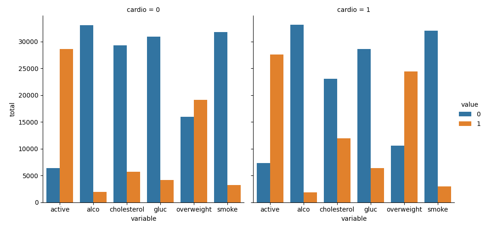
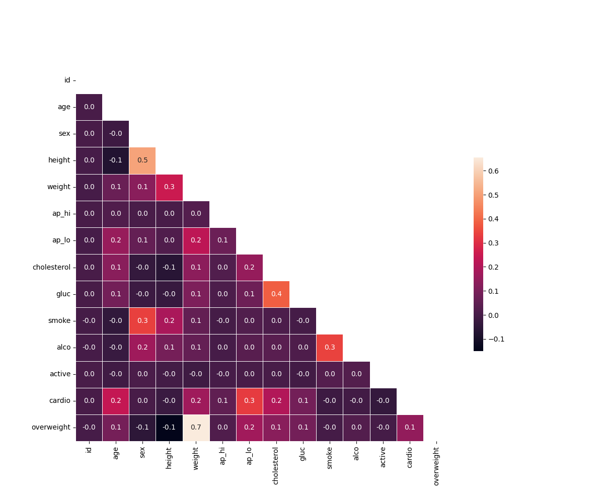

# Medical Data Visualizer

A program that analyzes and visualizes medical examination data to explore the relationship between cardiovascular disease, body measurements, blood markers, and lifestyle choices.

### Technologies

- Python
- Pandas
- Matplotlib
- Seaborn

### Visualizations

*Categorical plot showing the counts of medical and lifestyle features by cardiovascular disease status.*

*Heat map showing correlations between medical examination features after filtering out incorrect or extreme data.*

---
This project was completed as part of the Data Analysis with Python certification from freeCodeCamp — [Medical Data Visualizer Project](https://www.freecodecamp.org/learn/data-analysis-with-python/data-analysis-with-python-projects/medical-data-visualizer).
